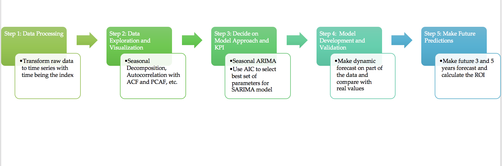

# Time Series Analysis and Modeling - Predicting Best Areas to Invest in Brooklyn, NY 

## Table of contents
* [Project Overview](#project-overview)
* [Statistical Methods](#statistical-methods)
* [Project Workflow](#project-workflow)
* [Summary](#summary)

## Project Overview

Brooklyn, one of the five boroughs in New York City, is increasingly favored by investors and home buyers because of the relatively lower price (than Manhattan), larger space and the convenience to the city life. It is diverse by many metrics, which keeps so dynamic and interesting.  

In this analysis, our goal is to provide you 5 zip codes/neighborhoods that could potentially maximize your Return on Investment in 3 years and 5 years. The analysis was based on data as of Feburary 2020, therefore the result might be changing overtime. 

[Dataset](https://www.zillow.com/research/data/): past 8 years monthly house price from zillow.com as of Feb, 2020. 

## Statistical Methods

* Time Series Modeling with SARIMA

## Project Workflow

## Summary:

Based on our model, here is the ROI table and the top zipcodes with highest growth potential.

Future Considerations

There might be different metrics to evaluate ROI for rental vs re-sale such as price to rent ratio, monthly avg rental income, tax, etc. Investor’s input (safety, convenience, school district, budget limit) may also be factored in. 

A linear model with more additional features such as federal interest rate, house market safety score, etc. is more accurate than pure time series model.

### [Presentation](https://github.com/bonniema/House-Price-Prediction-with-Time-Series/blob/master/Brooklyn_House_Price_Time_Series.pptx)

### [Notebook](https://github.com/bonniema/House-Price-Prediction-with-Time-Series/blob/master/TimeSeries_Modeling_Analysis.ipynb)

### [Check out the blog post related to this project](https://towardsdatascience.com/time-series-modeling-with-arima-to-predict-future-house-price-9b180c3bbd2f)

